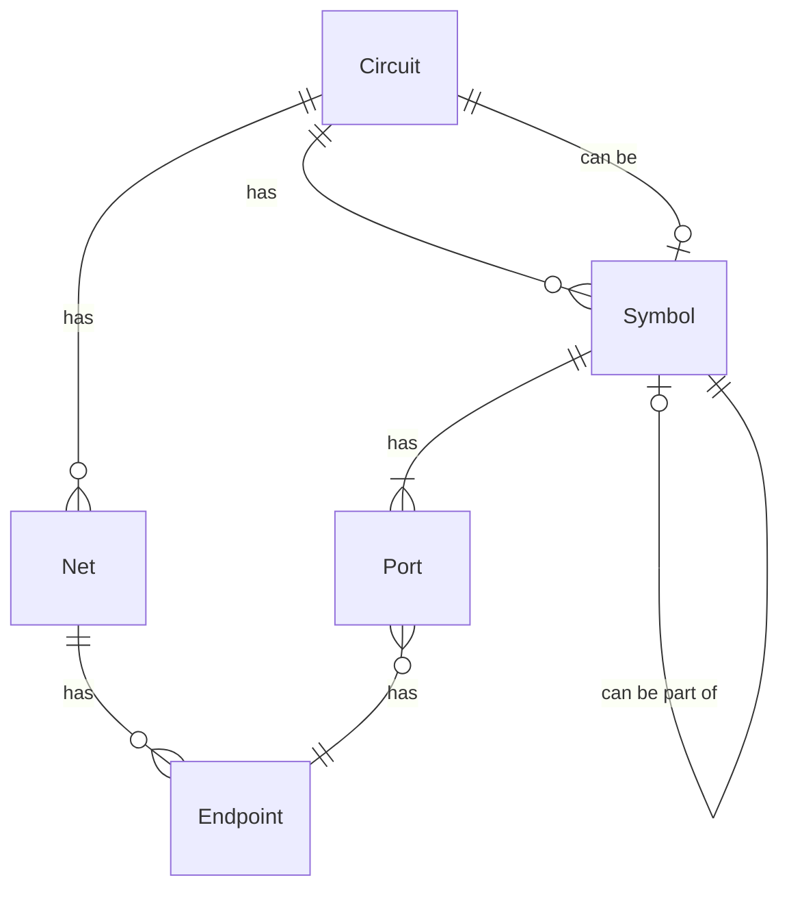
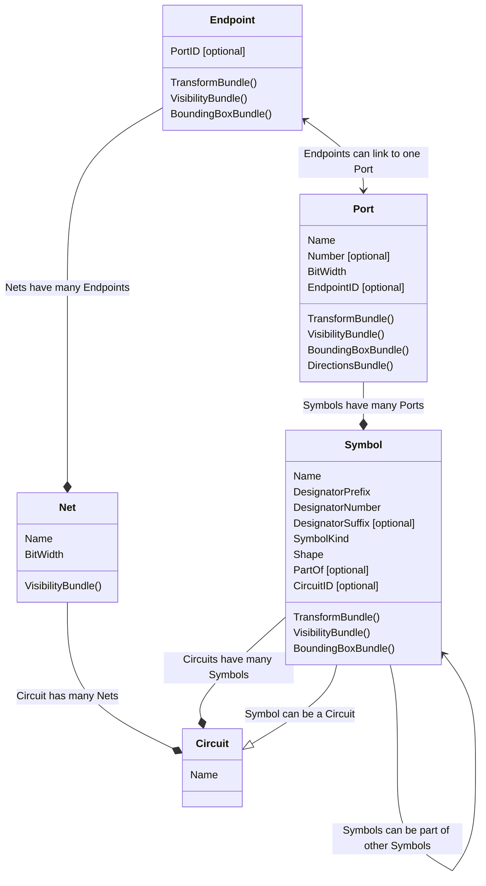

# Core Entities

## Definitions

- A `Circuit` is a collection of `Net`s and `Symbol`s
- A `Symbol` is an electronic component or schematic symbol
    - A `Symbol` can optionally point to a `Circuit` which implements the `Symbol` and is how sub-circuits are represented
    - A `Symbol` may optionally be part of another `Symbol` and is how multi-part components, such as the gates inside a single IC, are represented
- A `Port` is a pin or electrical connection point on a `Symbol`
- A `Net` is a collection of `Endpoint`s representing electrically connected `Port`s that are wired together
- An `Endpoint` represents the end of a wire in a `Net` and can be floating or connected to a `Port`

Note that wires are built by the auto-router and attached to a `Net` as a list of wires each with a list of vertices. That is not (currently) part of the core but rather in the [digilogic_routing crate](../crates/digilogic_routing/src/lib.rs).

## Relationships

Here is a diagram showing how the core entities relate to one another:

- `Circuit`s can have many `Net`s
    - `Net`s can have many `Endpoint`s
        - An `Endpoint` can be linked to a `Port`
- `Circuit`s can have many `Symbol`s
    - `Symbol`s have one or more `Port`s
        - A `Symbol` can be a `Circuit`
            - This is how sub-circuits are handled
        - A `Symbol` can be part of another `Symbol`
            - For example, a gate of a chip

For a list of components belonging to each entity, see the [bundles file](../crates/digilogic_core/src/bundles.rs) in the [digilogic_core crate](../crates/digilogic_core/).

## Class Diagram

Here is the class diagram of each entity with the components each would generally have:

Bundles were represented as methods mainly because mermaid expects methods on classes. They are not actually methods, but rather, bundles of components that generally belong together.

- The VisibilityBundle is attached to entities that can be visible, and inherits visibility from its parents
- The TransformBundle is attached to entities that have a location within the schematic, and can be transformed by its parent's transform
- The BoundingBoxBundle is attached to entities that take up space (that is, have a size), and are inserted into a SpatialIndex for fast lookup
